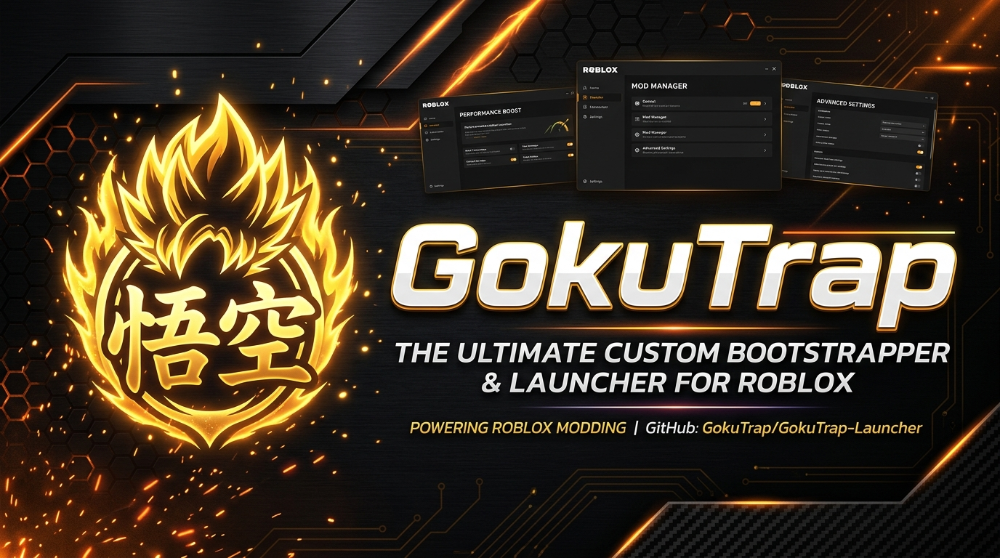
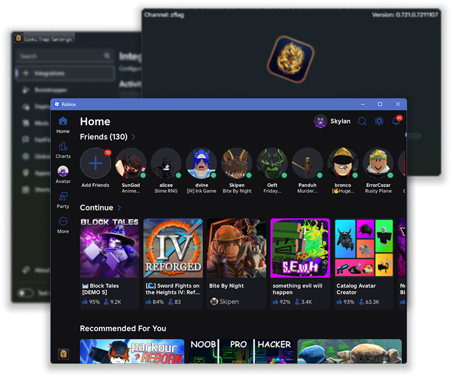

# GokuTrap

> [!CAUTION]
> The only official places to download GokuTrap are this GitHub repository and
> our official releases. Any other websites offering downloads
> or claiming to be us are not controlled by us; do not download from them.

<div align="center">

<picture>
  <source media="(prefers-color-scheme: dark)" srcset="Images/GokuTrap-Dark.png">
  <source media="(prefers-color-scheme: light)" srcset="Images/GokuTrap-Light.png">
  
</picture>

<br/><br/>

![License][badge-license]
![Builds][badge-actions]
[![Latest Release][badge-latest]][repo-latest]
![Stars][badge-stars]

</div>

**GokuTrap** is an all-in-one modern custom bootstrapper and launcher for Roblox, built to give you total control over your game client, appearance, performance, and integrations.

If you encounter any bugs, please [open an issue here][repo-new-issue].

> [!NOTE]
> GokuTrap is an application for **Windows 10 and above (64-bit).**

---

## 📸 Showcase

<div align="center">

<picture>
  <source media="(prefers-color-scheme: dark)" srcset="Images/Showcase-Dark.png">
  <source media="(prefers-color-scheme: light)" srcset="Images/Showcase-Light.png">
  
</picture>

</div>

---

## ⚡ Features

- **Custom Bootstrapper Styles & Theming**
  - Choose between modern Fluent, glass/acrylic, terminal, legacy, or custom XML-authored bootstrapper designs.
  - Custom branding and launcher icons (GokuTrap signature, Ultra Instinct alternate, legacy eras, or custom .ico files).
- **FastFlags Management & Presets**
  - Unlock framerates, tweak rendering, adjust display scaling, and manage game engine flags directly.
- **Global Basic Settings (GBS) Editor**
  - Pre-configure in-game graphics quality, framerate caps, UI transparency, reduced motion, and mouse sensitivity.
- **Rich Activity & Integrations**
  - Discord Rich Presence with game details, place information, and deep-link join support.
  - Server location and datacenter queries with map display.
  - Multi-instance launch support and background Roblox optimization.
- **Client Modifications (Mods)**
  - Seamlessly apply custom fonts, cursor packs (2006, 2013, or custom), classic character sounds (OOF, classic jump/walk), and custom skyboxes.
- **Channel Switching & Version Control**
  - Switch release channels and force deployment versions effortlessly.
- **Diagnostic & Maintenance Tools**
  - Built-in cache cleaner, log exporter, and automated migration from older launchers (Bloxstrap / Fishstrap).

---

## 🚀 Building from Source

### Prerequisites
- [.NET 6.0 SDK](https://dotnet.microsoft.com/download/dotnet/6.0) or higher (.NET 10 compatible)
- Windows 10/11 x64

### Build Command
```bash
dotnet build GokuTrap.sln -c Release
```

### Publish Single-File Executable
```bash
dotnet publish GokuTrap/GokuTrap.csproj -p:PublishSingleFile=true -r win-x64 -c Release --self-contained false
```
The output binary will be located in `GokuTrap/bin/Release/net6.0-windows/win-x64/publish/GokuTrap.exe`.

---

## 🎨 Asset Management

GokuTrap includes a self-contained Python asset pipeline that synchronizes and generates all multi-size `.ico` packages and showcase mockups from source:

```bash
python Scripts/GenerateAssets.py
```

---

[badge-license]:   https://img.shields.io/github/license/gokuthug1/GokuTrap?style=flat-square
[badge-actions]:   https://img.shields.io/github/actions/workflow/status/gokuthug1/GokuTrap/ci-release.yml?branch=main&style=flat-square&label=builds
[badge-latest]:    https://img.shields.io/github/v/release/gokuthug1/GokuTrap?style=flat-square&color=ff7b00
[badge-stars]:     https://img.shields.io/github/stars/gokuthug1/GokuTrap?style=flat-square&color=dd9900

[repo-latest]:    https://github.com/gokuthug1/GokuTrap/releases/latest
[repo-new-issue]: https://github.com/gokuthug1/GokuTrap/issues/new/choose
